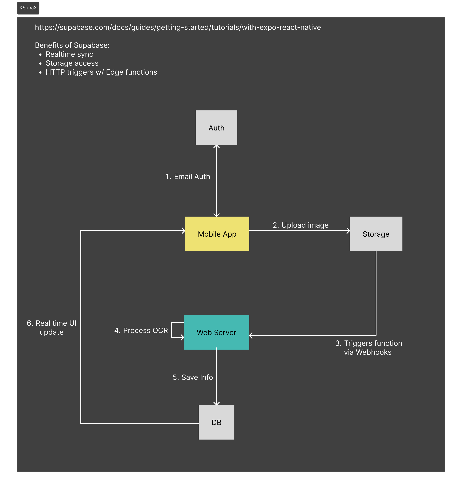

## Mobile App

### Stacks

- React Native w/ Expo & TypeScript
- Supabase Cloud services (Functions, Webhooks, Storage, PostgreSQL)
- Node.js



#### Getting started with Supabase:

- https://supabase.com/docs/guides/getting-started/tutorials/with-expo-react-native
- https://github.com/saimon24/react-native-resumable-upload-supabase/tree/main
- https://youtube.com/shorts/mbdHzyRs9bo?si=UNp2TUy-OfNXF1Gg

### Supabase Queries

1. Storage Policies

```
CREATE POLICY "Give users access to own folder" ON storage.objects
AS permissive
FOR ALL
TO authenticated
USING (bucket_id = 'snapshots' AND auth.uid()::text = (storage.foldername(name))[1])
WITH CHECK (bucket_id = 'snapshots' AND auth.uid()::text = (storage.foldername(name))[1]);
```

2. User Management

```
-- Create a table for public profiles
create table profiles (
  id uuid references auth.users on delete cascade not null primary key,
  created_at timestamp default now(),
  updated_at timestamp with time zone,
  username text unique,

  constraint username_length check (char_length(username) >= 3)
);
-- Set up Row Level Security (RLS)
-- See https://supabase.com/docs/guides/auth/row-level-security for more details.
alter table profiles
  enable row level security;

create policy "Users can perform all actions on their own profile." on profiles
  for all using (auth.uid() = id) with check (auth.uid() = id);

-- This trigger automatically creates a profile entry when a new user signs up via Supabase Auth.
-- See https://supabase.com/docs/guides/auth/managing-user-data#using-triggers for more details.
create function public.handle_new_user()
returns trigger as $$
begin
  insert into public.profiles (id)
  values (new.id);
  return new;
end;
$$ language plpgsql security definer;
create trigger on_auth_user_created
  after insert on auth.users
  for each row execute procedure public.handle_new_user();
```

#### Todo

- Set Magic link for confirmation address
